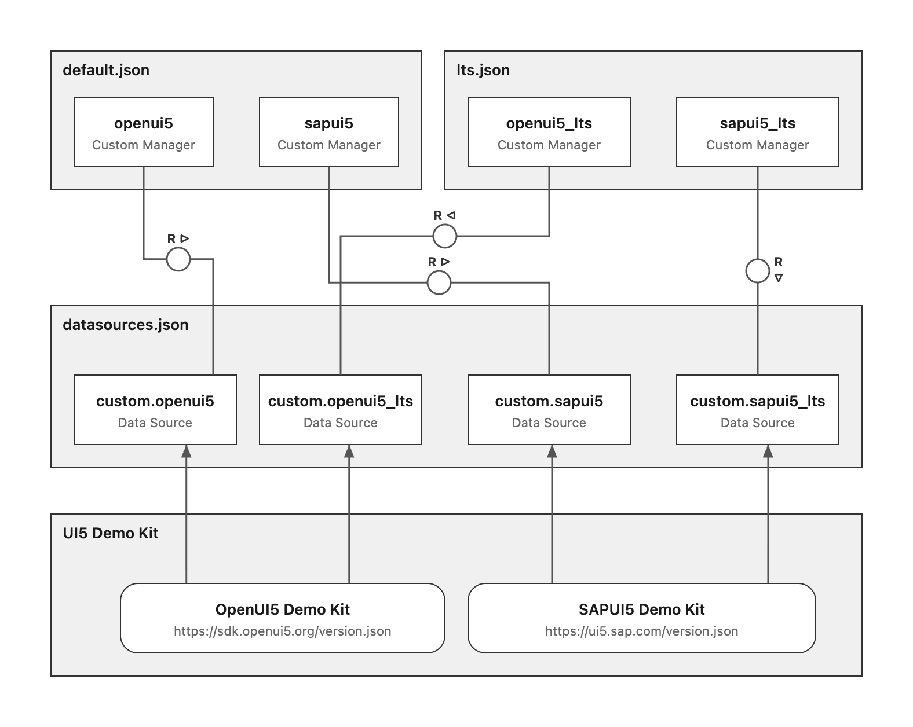

# UI5 Renovate Preset Config Development

**Note:** This document is intended to support UI5 Renovate Preset Config developers and is not relevant for end users of the UI5 Renovate Preset Config.

## Architecture

## Components

### Custom Managers for UI5 framework (`default.json`)
Tracks all UI5 framework versions. Contains two Custom Managers:
- **`openui5`** — tracks OpenUI5 versions.
- **`sapui5`** — tracks SAPUI5 versions.

### Custom Managers for LTS versions of UI5 framework (`lts.json`)
Tracks only LTS (Long-Term Support) UI5 framework versions. Contains two Custom Managers:
- **`openui5_lts`** — tracks OpenUI5 LTS versions.
- **`sapui5_lts`** — tracks SAPUI5 LTS versions.

### Data Sources (`datasources.json`)
Custom data sources used by the Custom Managers above, each backed by the respective UI5 Demo Kit:
- **`custom.openui5`** — OpenUI5 versions (used by `openui5`).
- **`custom.openui5_lts`** — OpenUI5 LTS versions (used by `openui5_lts`).
- **`custom.sapui5`** — SAPUI5 versions (used by `sapui5`).
- **`custom.sapui5_lts`** — SAPUI5 LTS versions (used by `sapui5_lts`).

### UI5 Demo Kits
External version endpoints queried by the data sources:
- **OpenUI5 Demo Kit** — `https://sdk.openui5.org/version.json`
- **SAPUI5 Demo Kit** — `https://ui5.sap.com/version.json`

